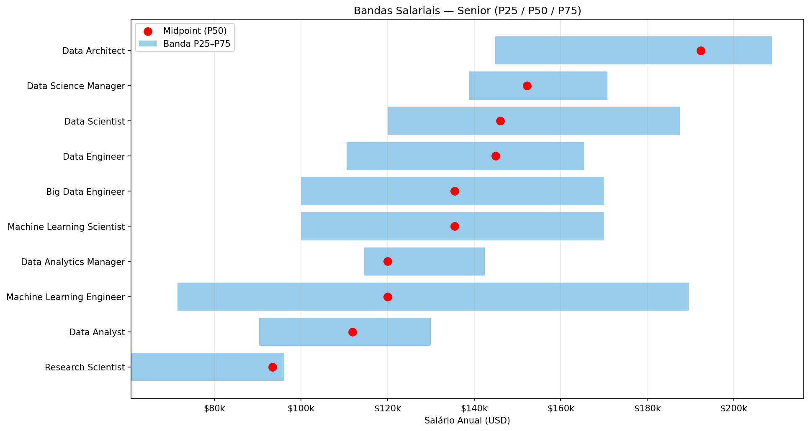
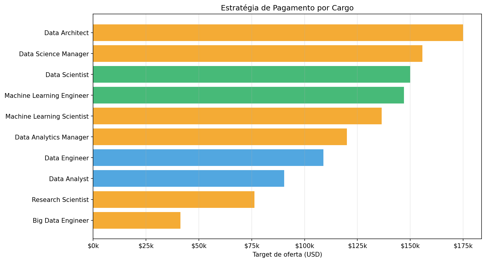

# Compensation Strategy 2025 — Tabela Salarial Tech

## Sumário Executivo

- **Universo benchmark:** 607 profissionais
- **Mediana global:** USD 101,570
- **Cargos mapeados:** 10
- **Tendência YoY:** 0.0%

---

## 1. Bandas Salariais (P25 / P50 / P75) — Senior

## 2. Estratégia de Pagamento por Cargo

| Cargo | n | P25 | P50 | P75 | Estratégia | Target |
|---|---|---|---|---|---|---|
| Data Scientist | 159 | $59,734 | $109,000 | $150,000 | PAGAR_P75 | $150,000 |
| Data Engineer | 158 | $69,806 | $108,912 | $154,900 | PAGAR_P50 | $108,912 |
| Data Analyst | 119 | $60,650 | $90,320 | $116,075 | PAGAR_P50 | $90,320 |
| Machine Learning Engineer | 42 | $53,961 | $87,932 | $147,000 | PAGAR_P75 | $147,000 |
| Research Scientist | 16 | $62,176 | $76,264 | $105,000 | PAGAR_P50_RECONHECER_DADO_RASO | $76,264 |
| Data Science Manager | 12 | $142,285 | $155,750 | $178,050 | PAGAR_P50_RECONHECER_DADO_RASO | $155,750 |
| Data Architect | 12 | $147,064 | $175,000 | $196,617 | PAGAR_P50_RECONHECER_DADO_RASO | $175,000 |
| Big Data Engineer | 8 | $17,557 | $41,306 | $79,756 | PAGAR_P50_RECONHECER_DADO_RASO | $41,306 |
| Machine Learning Scientist | 12 | $65,850 | $136,500 | $225,000 | PAGAR_P50_RECONHECER_DADO_RASO | $136,500 |
| Data Analytics Manager | 7 | $114,640 | $120,000 | $142,500 | PAGAR_P50_RECONHECER_DADO_RASO | $120,000 |

## 3. Tabela Salarial Completa (Senior)

| Cargo | Mín (P25) | Mid (P50) | Máx (P75) | Spread | n |
|---|---|---|---|---|---|
| Data Architect | $144,854 | $192,400 | $208,775 | 33% | 9 |
| Data Science Manager | $138,856 | $152,250 | $170,836 | 21% | 10 |
| Data Scientist | $120,080 | $146,000 | $187,550 | 46% | 71 |
| Data Engineer | $110,500 | $145,000 | $165,400 | 38% | 77 |
| Big Data Engineer | $100,000 | $135,500 | $170,000 | 52% | 280 |
| Machine Learning Scientist | $100,000 | $135,500 | $170,000 | 52% | 280 |
| Machine Learning Engineer | $71,444 | $120,000 | $189,650 | 99% | 21 |
| Data Analytics Manager | $114,640 | $120,000 | $142,500 | 23% | 7 |
| Data Analyst | $90,320 | $111,912 | $130,000 | 35% | 58 |
| Research Scientist | $60,757 | $93,427 | $96,113 | 38% | 5 |

---

## Metodologia

- **Bandas**: P25 (mín) / P50 (mid) / P75 (máx) — convenção HR.
- **Spread = (Máx − Mín) / Mid**: tipicamente 35-50% em tech.
- **Estratégia PAGAR_P75**: cargos críticos / hard-to-fill (ML Engineers, Data Scientists).
- **Estratégia PAGAR_P50**: maioria dos cargos com pipeline saudável.
- **Comp Ratio**: oferta / P50 do mercado (UNDERPAID < 0.85 < MARKET < 1.15 < PREMIUM < 1.30 < OUTLIER).